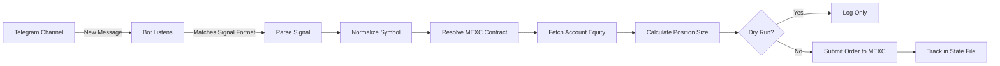

# MEXC Futures SDK + Telegram Signal Bot

A TypeScript SDK for MEXC Futures trading with REST API and WebSocket support, plus a built-in Telegram signal bot that auto-executes trades from channel messages.

⚠️ **DISCLAIMER**: This SDK uses browser session tokens and reverse-engineered endpoints. MEXC does not officially support futures trading through API. Use at your own risk.

<p align="center">
  <a href="https://discord.gg/bZeQd4rMW9"></a>
  <a href="https://t.me/yobebka"></a>
  <a href="https://www.npmjs.com/package/mexc-futures-sdk"></a>
</p>

---

## Table of Contents

- [Quick Start (Local Bot)](#quick-start-local-bot)
- [Authentication](#authentication)
- [Telegram Signal Bot](#-telegram-signal-bot)
  - [How It Works](#how-it-works)
  - [Signal Formats](#signal-formats)
  - [Configuration Reference](#configuration-reference)
  - [Running the Bot](#running-the-bot)
  - [Position-Close Notifications](#-position-close-notifications)
  - [Periodic Position Summary](#-periodic-position-summary)
- [Creating the Telegram Bot & Adding Channels](#-creating-the-telegram-bot--adding-channels)
- [Remote Server Deployment](#-server-deployment)
- [Desktop App & Auto-Updates](#-desktop-app--auto-updates)
- [SDK Usage (Programmatic)](#sdk-usage-programmatic)
- [API Reference](#api-reference)
- [Safety Features](#safety-features)

---

## Quick Start (Local Bot)

```bash
# 1. Install dependencies
npm install

# 2. Copy and configure environment
cp .env.example .env
# Edit .env with your MEXC keys and Telegram bot token

# 3. Build the project
npm run build

# 4. Run in dry-run mode first (no real trades)
DRY_RUN=true npm run bot

# 5. When ready, enable live trading
DRY_RUN=false npm run bot
```

---

## Authentication

The SDK supports **two** authentication methods. API keys are preferred for bot usage.

### Method 1: MEXC API Key + Secret (Recommended)

Set these in your `.env`:

```bash
MEXC_KEY=mx0your_api_key_here        # Your MEXC API key
MEXC_SECRET_KEY=your_secret_here      # Your MEXC API secret
```

The bot uses HMAC-SHA256 signing with these credentials.

### Method 2: Browser WEB Token (Legacy)

1. Login to MEXC Futures in your browser
2. Open Developer Tools (F12) → Network tab
3. Make any request to `futures.mexc.com`
4. Find the `authorization` header (starts with `WEB...`)
5. Set `MEXC_AUTH_TOKEN=WEB...` in your `.env`

---

## 🤖 Telegram Signal Bot

The bot listens for trading signals posted in Telegram channels, parses them, validates against MEXC contracts, sizes positions based on your risk parameters, and executes trades automatically.

### How It Works



### Signal Formats

The bot recognizes these signal patterns:

```
BUY TAOUSDT@187.54 SL 185.13 TP 188.81
SELL BTCUSDT@65000 SL 66000 TP 63000
BUY ETHUSDT@3500 SL 3400 TP1 3600 TP2 3700 TP3 3800
BUY SOLUSDT@150 SL 145
BUY TAOUSDT@187.54 SL 185.13 TP 188.81 R2 L50 V7
```

| Element | Meaning |
|---|---|
| `BUY` / `SELL` | Direction: BUY = long, SELL = short |
| `SYMBOL@PRICE` | Trading pair and entry price |
| `SL <price>` | Stop-loss price (mandatory) |
| `TP <price>` | Take-profit (optional — defaults to 1.5× risk) |
| `TP1/TP2/TP3` | Multiple TP targets — volume is split equally |
| `R<number>` | Risk per trade override in % (e.g. `R2` = 2%, valid 0–6) |
| `L<number>` | Leverage override (e.g. `L200` = 200x, valid 1–200, clamped to the contract max) |
| `V<number>` | Plan-order validity: `V1`/absent = 24h, `V7` = 7 days |

**Symbol normalization**: `TAOUSDT` → `TAO_USDT`, `BTCUSDT` → `BTC_USDT`

### Configuration Reference

All settings are environment variables. Copy `.env.example` and fill in:

| Variable | Default | Description |
|---|---|---|
| **Required** | | |
| `MEXC_KEY` | — | MEXC API key (starts with `mx0...`) |
| `MEXC_SECRET_KEY` | — | MEXC API secret key |
| `TELEGRAM_BOT_TOKEN` | — | Telegram Bot token from @BotFather |
| `ALLOWED_CHANNELS` | — | Comma-separated channel IDs or usernames |
| `CONFIRM_CHANNELS` | — | Subset of `ALLOWED_CHANNELS` where signals are **queued** (awaiting `CONFIRM ORDERS`). Channels not listed here auto-place immediately. Leave empty to disable the confirmation flow entirely. |
| **Trading** | | |
| `DEFAULT_LEVERAGE` | `10` | Leverage (1–200) |
| `OPEN_TYPE` | `1` | `1` = isolated margin, `2` = cross margin |
| `RISK_PERCENT` | `0.01` | Risk per trade (0.01 = 1% of equity) |
| `DEFAULT_TP_RATIO` | `1.5` | Default TP:SL ratio when no TP in signal |
| `MAX_CONCURRENT_TRADES` | `5` | Max simultaneous open positions |
| `MAX_NOTIONAL_PER_TRADE` | `10000` | Max USDT notional value per trade |
| `USE_LIMIT_TP_SL` | `false` | Place TP/SL as **Limit (Maker)** Stop-Limit orders (0% maker fee) instead of market (taker) TP/SL. Applies to market entries; plan/stop entries keep market TP/SL (a warning is logged) |
| `USE_MAKER_CLOSE` | `false` | Close positions with **Limit (Maker)** orders at the best bid/ask instead of market (taker) orders — maker fills pay the maker fee (often 0%) instead of taker (0.05%). Falls back to a market close after ~2.5s if the maker order hasn't filled |
| **Safety** | | |
| `DRY_RUN` | `true` | Parse & size, but don't submit orders |
| `TRADING_ENABLED` | `true` | Master trading on/off switch |
| **Other** | | |
| `LOG_LEVEL` | `INFO` | `SILENT`, `ERROR`, `WARN`, `INFO`, `DEBUG` |
| `BASE_CURRENCY` | `USDT` | Base currency for equity checks |
| `STATE_FILE_PATH` | `./bot-state.json` | Idempotency state file location |
| `MEXC_AUTH_TOKEN` | — | Legacy: browser WEB token (not needed with API keys) |
| **Position-Close Notifications** | | |
| `PNL_NOTIFICATION_CHANNEL` | *(empty)* | Channel/chat ID that receives realized PNL + balance updates when a position closes. Empty disables the feature |
| `POSITION_MONITOR_INTERVAL_SECONDS` | `30` | How often (s) to poll MEXC for closed positions (min 5) |
| **Position Summary** | | |
| `SUMMARY_NOTIFICATION_CHANNEL` | *(empty)* | Channel/chat ID for the periodic position summary. Empty = reuse `PNL_NOTIFICATION_CHANNEL` |
| `SUMMARY_INTERVAL_HOURS` | `8` | How often (h) the position summary is sent |
| `SUMMARY_WINDOW_HOURS` | `4` | Trailing window (h) for the PNL max/min stats shown in the summary |
| **API Rate Limiting** | | |
| `ORDER_RATE_CAPACITY` | `3` | Token-bucket burst capacity — max MEXC API requests fired immediately before throttling |
| `ORDER_RATE_INTERVAL_MS` | `200` | Spacing (ms) between requests after the burst is spent (sustained ≈ 5 req/s) |

### ⏳ API Rate Limiting

Signals with multiple orders + TPs (e.g. 2 orders × 3 TPs = 6 order submissions, plus the
pre-order ticker/equity/position calls) can fire a burst that exceeds MEXC's request limit,
causing `513` rejections. The bot applies a **token-bucket rate limiter to every MEXC API call**
that:

- **Bursts first** — up to `ORDER_RATE_CAPACITY` requests are sent back-to-back with **zero**
  delay, so normal signals are placed as fast as possible (no artificial sleep).
- **Then spaces out** — once the burst is spent, excess requests are queued FIFO and released
  one every `ORDER_RATE_INTERVAL_MS`, keeping the sustained rate safe.

For the default `ORDER_RATE_CAPACITY=3` / `ORDER_RATE_INTERVAL_MS=200`, a 6-order signal
places 3 orders immediately and the rest at ~200ms intervals — all done in under a second,
without exhausting the API. If you still see `513` errors, lower `ORDER_RATE_CAPACITY`
to `1`–`2`; if you want more burst headroom, raise it. Throttling events are logged as
`⏳ MEXC rate-limit: throttled ... (waited Xms)`.

### 🛡️ Limit (Maker) TP/SL — `USE_LIMIT_TP_SL`

By default the bot attaches **market** take-profit and stop-loss orders to every entry.
Market (taker) exits incur the taker fee on both the TP and the SL. Setting
`USE_LIMIT_TP_SL=true` switches TP/SL to **Stop-Limit orders** placed via
`/private/stoporder/place`:

- The market entry is submitted **without** attached TP/SL.
- Once the position opens, a **limit** TP and a **limit** SL are attached to the
  position at the signal's TP/SL prices (`takeProfitType=1` / `stopLossType=1`).
- If the limit order rests in the book and adds liquidity when it fills, it's executed
  as a **maker order** — potentially **0% fee** on the exit.
- If placing a limit TP/SL fails, the bot automatically falls back to a **market**
  TP/SL via the same endpoint so your position is never left unprotected.

> ⚠️ **Stop-entry (plan/trigger) orders** can't attach limit TP/SL until the position
> actually opens, so they keep market TP/SL (a warning is logged). Limit TP/SL applies
> to market entries (`@`/`EP`-free signals), which is the default signal type.

### Running the Bot

The bot runs as a single Node.js process — no daemon or container is required.
All file paths in `.env` are resolved against the working directory.

```bash
# Build once (or after any source change)
npm run build

# Run (foreground — Ctrl+C to stop)
node dist/bot/index.js

# Run in background
nohup node dist/bot/index.js > bot.log 2>&1 &
# Check logs: tail -f bot.log
```

**First run checklist:**
1. Start with `DRY_RUN=true` — verify signals are parsed correctly
2. Check logs for symbol normalization and contract resolution
3. Once confident, set `DRY_RUN=false` and `TRADING_ENABLED=true`
4. Monitor your first few trades closely

### 📨 Position-Close Notifications

When a position closes (TP, SL, or manual close), the bot can send a summary to a **separate channel of your choice**, showing:

- **Realized PNL** — the amount in USDT plus the return as a % of the position's initial margin
- **Entry → Exit** prices, direction (LONG/SHORT), leverage and margin mode
- **Available balance** and **equity** after the close

Example message:

```
📊 POSITION CLOSED

🪙 BTC_USDT · LONG · 10x · Isolated
Entry: 67,000.00 → Exit: 69,000.00

📈 Realized PNL: +176.70 USDT (+5.12%)

💼 Available: 1,234.56 USDT
📈 Equity: 5,678.90 USDT
```

**Setup:**

1. Set `PNL_NOTIFICATION_CHANNEL` in `.env` to the channel/chat ID you want the notifications sent to (numeric or `@username`). Leave it empty to disable the feature.
2. Add your bot as an **admin** in the notification channel (otherwise sending will be forbidden).
3. Optionally tune `POSITION_MONITOR_INTERVAL_SECONDS` (default `30`, min `5`) — how often the bot polls MEXC to detect a closed position.

> 💡 The monitor detects **any** position on your account that closes — whether opened by the bot or manually. On startup it seeds its known-position list, so positions that already closed while the bot was offline won't trigger notifications.

### 📊 Periodic Position Summary

Every `SUMMARY_INTERVAL_HOURS` (default `8`), the bot sends a summary of the current account state to the summary channel, showing:

- **Open positions** — symbol, direction, leverage, entry price, **current PNL**, and the **max / min PNL** reached over the trailing `SUMMARY_WINDOW_HOURS` (default `4` hours), plus each position's **position ID**, its **estimated TP / SL P&L** and the **% of the TP target already reached**
- **Pending orders** — one line per pending STOP (entry) order: symbol, direction, trigger price, volume and a shortened **order ID**
- **Available balance** and **equity**

Example message:

```
📊 POSITION SUMMARY
⏱️ Last 4h · report every 8h

📂 Open Positions (2)
──────────────
🟢 BTC_USDT LONG · 10x
Entry: 67,000.00
PNL: +176.70 USDT
   max +210.10 / min -5.30 USDT
🎯 Est TP +500.00 / SL -250.00 USDT · 35% of TP
🆔 5839201
──────────────
🔴 ETH_USDT SHORT · 5x
Entry: 3,500.00
PNL: -12.00 USDT
   max +40.50 / min -15.20 USDT
🎯 Est TP +180.00 / SL -90.00 USDT · -7% of TP
🆔 2948573

📌 Pending Orders (2)
🟡 TAO_USDT LONG · STOP ≥187.54 · 0.50 · <code>…397504</code>
🟡 ETH_USDT SHORT · TP ≤1,856.00 / SL ≥1,884.95 · 0.17 · <code>…2904</code>

💼 Available: 1,234.56 USDT
📈 Equity: 5,678.90 USDT
```

The **estimated TP/SL P&L** is what the position would make/lose if the price reached its take-profit or stop-loss level (derived from the current PNL, entry, volume and the contract's size). The **% of TP** shows how much of that target is already banked as unrealized PNL (negative = currently losing). The SL/TP levels come from the bot's own orders (stored at execution) and, as a fallback, from the pending TP/SL stop orders on the exchange — so the estimate and the >50% alerts keep working across restarts and for manually opened positions.

Pending orders are the orders currently open on the exchange, fetched from the futures API in two calls and shown one line each:
- **STOP entries** — from `GET /private/planorder/list/orders` (untriggered): direction, `STOP` with its trigger condition (`≥`/`≤`) and price.
- **TP/SL pairs** — from `GET /private/stoporder/list/orders` (uncompleted): direction plus `TP … / SL …` with the correct trigger direction (a long's TP fires on a rise, SL on a fall; a short's the reverse).

Order IDs are shown shortened for a compact layout — the full IDs appear in the order-placed alerts.

**Setup:**

1. Set `SUMMARY_NOTIFICATION_CHANNEL` in `.env` (numeric ID or `@username`). Leave it empty to reuse `PNL_NOTIFICATION_CHANNEL`.
2. The bot samples unrealized PNL on the same `POSITION_MONITOR_INTERVAL_SECONDS` cadence to build the max/min stats.
3. Tune the cadence with `SUMMARY_INTERVAL_HOURS` and the reporting window with `SUMMARY_WINDOW_HOURS`.

> 💡 Max/min PNL is tracked only while the bot is running (it polls unrealized PNL continuously). If the bot restarts, the stats begin accumulating again from scratch.

**Verifying polling & persistence:**

- The bot logs `📊 Polling active: N open position(s)` at INFO on the first successful poll.
- Poll stats are written to `<STATE_FILE_PATH>-summary-stats.json` (e.g. `./bot-summary-stats.json`) — check its `stats` array and `updatedAt` timestamp.
- Set `LOG_LEVEL=DEBUG` to see per-poll lines (`📊 Polled N open position(s) …`) and per-source pending-order status (`📦 Pending order sources → …`).
- All HTTP requests and responses (including pending-order endpoint attempts) are logged to `{LOG_DIR}/http-YYYY-MM-DD.log` — check this file for raw MEXC API responses if pending orders show 0.

**On-demand summary:**

Send `CHECK POSITIONS` (or the shorthand `@`) to the summary channel and the bot will emit the position summary **immediately**, without waiting for the next `SUMMARY_INTERVAL_HOURS` tick. Both forms are case-insensitive (for the word form), work regardless of whether the summary channel is listed in `ALLOWED_CHANNELS`, and each message is only honored once (idempotent across restarts).

```
CHECK POSITIONS
@
```

> 💡 The on-demand summary reflects the same data as the periodic one, including the current / max / min PNL tracked over the trailing window. If the summary feature is disabled (no `SUMMARY_NOTIFICATION_CHANNEL`), the command is ignored.

**50%-of-way alerts:**

While the summary monitor polls open positions, it also checks whether the current price has travelled more than halfway from entry toward the stop-loss or the take-profit. When the >50% threshold is crossed, an alert is sent to the summary channel — once per position per target. Example:

```
🚨 POSITION ALERT — 65% toward SL

🪙 BTC_USDT · LONG · 10x
Entry: 67,000.00 → Now: 66,350.00
🎯 Stop-loss @ 66,000.00 — 65% of the way
```

The SL/TP levels come from the bot's own order execution (and, as a fallback, from the pending TP/SL stop orders on the exchange, so alerts survive restarts and cover manually opened positions with attached TP/SL). Progress is computed from the position's unrealized PNL, volume and the contract's size, so it stays correct for contracts with a non-1 contract size (e.g. ATOM 0.1, BTC 0.0001). Alert flags are reset when the position closes, so a new position on the same symbol can alert again. Stale entries older than `LOG_RETENTION_DAYS` are pruned automatically.

**Closing a position manually:**

Send `Close {id}` to an allowed channel and the bot will resolve the position and close it immediately with a market order. A confirmation is sent to the summary channel.

The summary shows the recommended identifier for each open position — its **position ID** — as the ready-to-use close command `🆔 CLOSE {positionId}`:

```
Close 1462152523
```

A **partial close** is supported by appending a percentage:

```
Close 1462152523 30%
```

The position ID is preferred because it always exists on the open-positions API and carries the authoritative position direction, so closing by it never hits MEXC's "wrong direction" error (important in hedge mode, where a symbol can hold both a LONG and a SHORT simultaneously). For backward compatibility the command still accepts a MEXC fill order ID or plan/trigger order ID, which are resolved via the API. The command is idempotent and requires the channel to be in `ALLOWED_CHANNELS`.

### 🧾 Trade Confirmations & Order Queue (per-channel opt-in)

By default, signals from **all** `ALLOWED_CHANNELS` are placed **automatically** (no queue, no confirmation step). You can enable the queue+confirmation flow on specific channels by listing them in `CONFIRM_CHANNELS`:

| Channel in `CONFIRM_CHANNELS`? | Behaviour |
|---|---|
| Yes | Signal is **queued** — a trade confirmation is posted, and the order is **not** placed until the operator sends `CONFIRM ORDERS` |
| No | Signal is **auto-placed** immediately (no confirmation message) |

When the confirmation flow is active for a channel, a valid signal is parsed and sized, then the bot **queues** the order and sends a **trade confirmation** to the channel — showing the expected TP and expected SL, plus the estimated realized PNL **net of fees** when the contract fee rates are known:

```
🧾 TRADE CONFIRMATION

🪙 TAO_USDT · LONG · 50x · Isolated
💹 Market entry @ 123.00
📍 Expected TP: 124.00
   Est. net profit: +34.92 USDT (34.6%) · incl. fees
📉 Expected SL: 122.00
   Est. net loss: -47.03 USDT (-46.6%) · incl. fees
💵 Risk: 100.00 USDT (1.0%) · Notional: ~5,043.00 USDT
🧾 Est. fees: 6.08 USDT (3.03 entry + 3.05 exit)
📋 Queue: 1 order(s) pending — send CONFIRM ORDERS to place
⏳ Queued — awaiting CONFIRM ORDERS
```

The operator then decides what happens to the pending queue:

- `CONFIRM ORDERS` — places **every** queued order (market orders fill immediately, trigger entries are submitted as pending plan orders). Confirmation is idempotent per message.
- `CANCEL ORDERS` — discards the pending queue without placing anything.

Both commands only work from a channel listed in `CONFIRM_CHANNELS`.

### 🚀 Order Placement Alerts

Once `CONFIRM ORDERS` is sent, the bot also posts a short alert to the **summary channel** for each order that is successfully placed/executed (market fills immediately, trigger entries are placed as pending). It shows the symbol, direction, leverage, entry, SL/TP, volume, notional, risk and the order ID:

```
🚀 ORDER PLACED

🪙 TAO_USDT LONG · 50x · Isolated
💹 Market entry @ 123.00
SL: 122.00 · TP: 124.00, 125.00
Vol: 41 · Notional: ~5,043.00 USDT
Risk: 100.00 USDT (1.0%)

Order ID: 817027833053397504
```

> 💡 These alerts are sent only in live trading mode (`DRY_RUN=false`) — dry-run does not submit real orders.

---

## 📱 Creating the Telegram Bot & Adding Channels

This step-by-step guide walks you through creating a Telegram bot and configuring it to monitor trading signal channels.

### Step 1: Create the Bot with @BotFather

1. Open Telegram and search for **@BotFather** (the official bot creation tool)
2. Start a chat and send: `/newbot`
3. Choose a **name** (display name, e.g. "MEXC Signal Trader")
4. Choose a **username** (must end in `bot`, e.g. `mexc_signal_bot`)
5. BotFather will respond with your **bot token** — save it:

   ```
   Done! Congratulations on your new bot.
   
   Use this token to access the HTTP API:
   1234567890:ABCdefGHIjklMNOpqrsTUVwxyz
   
   Keep your token secure and store it safely.
   ```

6. Copy this token into your `.env` file:

   ```bash
   TELEGRAM_BOT_TOKEN=1234567890:ABCdefGHIjklMNOpqrsTUVwxyz
   ```

### Step 2: Disable Bot Privacy Mode (Required)

By default, bots cannot read messages in group chats. You MUST disable privacy mode:

1. In @BotFather, send: `/mybots`
2. Select your bot
3. Tap **Bot Settings** → **Group Privacy**
4. Select **Turn off** (Disable)
5. Confirm the change

> ⚠️ **Without this step, the bot will NOT see messages in channels/groups.**

### Step 3: Add the Bot to Your Signal Channels

For each channel you want to monitor:

1. Open the Telegram channel
2. Tap the channel name → **Administrators** (or **Subscribers** for public channels)
3. Tap **Add Admin** → search for your bot's username
4. **Grant the bot admin rights** — at minimum, it needs:
   - ✅ **Read Messages** (usually auto-granted)

   > Note: The bot needs to be an **admin** of the channel (not just a subscriber) to read messages via the Bot API.

5. Repeat for every channel you want to monitor.

### Step 4: Get Channel IDs

You need to tell the bot WHICH channels to listen to. Each channel has an identifier — either a numeric ID or a `@username`.

**For public channels with a username** (e.g. `@crypto_signals`):
```bash
ALLOWED_CHANNELS=@crypto_signals,@btc_alerts
```

**For private channels** (numeric IDs only):

1. **Method A — Forward a message to @RawDataBot:**
   - Forward any message from the channel to **@RawDataBot**
   - It replies with JSON containing `"chat":{"id":-1001234567890,...}`
   - The ID will be negative (e.g. `-1001234567890`) — use the full number

2. **Method B — Use the bot itself:**
   - Temporarily add this to `bot.ts`:
     ```typescript
     this.telegram.on(message("text"), (ctx) => {
       console.log("Chat ID:", ctx.chat.id);
     });
     ```
   - Send a test message in the channel — the bot logs the ID

3. Set the channel IDs in `.env`:
   ```bash
   ALLOWED_CHANNELS=-1001234567890,-1009876543210
   ```

### Step 5: Test the Setup

1. Start the bot with `DRY_RUN=true`:
   ```bash
   npm run bot
   ```
2. Post a test signal in one of your channels:
   ```
   BUY BTCUSDT@65000 SL 64000 TP 66000
   ```
3. Check the bot logs — you should see:
   ```
   📨 Message from -1001234567890#42: BUY BTCUSDT@65000...
   📊 Signal detected: BUY BTCUSDT@65000 SL 64000 TP 66000
   🔄 Normalized: BTCUSDT → BTC_USDT
   🧪 [DRY RUN] Would submit order: ...
   ```

If you see `📝 Not a trade signal — ignoring`, the message format isn't matching the parser. Check the signal format carefully.

### Troubleshooting Telegram Setup

| Problem | Solution |
|---|---|
| Bot doesn't see messages | Ensure Group Privacy is **disabled** in @BotFather |
| "Forbidden: bot is not a member" | Add the bot as an **admin** to the channel |
| Wrong channel ID | Private channels always have negative IDs starting with `-100` |
| Rate limited | Telegram limits bots to ~30 msg/sec — not an issue for signal monitoring |

---

## 🖥 Server Deployment

The bot runs as a single Node.js process. Deploy the project directory anywhere,
`cd` into it, and run `node dist/bot/index.js`.

```bash
# 1. Clone & set up the project
cd /opt/mexc-signal-bot
git clone https://github.com/oboshto/mexc-futures-sdk.git .
npm install && npm run build

# 2. Create and edit .env (see Configuration Reference above)
#    Keep paths relative — they resolve against the working directory:
#    STATE_FILE_PATH=./bot-state.json
#    LOG_DIR=./logs

# 3. Run
node dist/bot/index.js

# To keep running after logout:
nohup node dist/bot/index.js > bot.log 2>&1 &
tail -f bot.log
```

**systemd (optional):** A ready-to-use service file lives at `deploy/mexc-signal-bot.service`.

### Option C: Docker

Create a `Dockerfile` in the project root:

```dockerfile
FROM node:20-alpine AS builder
WORKDIR /app
COPY package*.json ./
RUN npm ci
COPY . .
RUN npm run build

FROM node:20-alpine
RUN addgroup -S mexcbot && adduser -S mexcbot -G mexcbot
WORKDIR /app
COPY --from=builder /app/dist ./dist
COPY --from=builder /app/node_modules ./node_modules
COPY --from=builder /app/package.json ./
USER mexcbot
CMD ["node", "dist/bot/index.js"]
```

```bash
# Build and run
docker build -t mexc-signal-bot .
docker run -d \
  --name mexc-signal-bot \
  --restart unless-stopped \
  --env-file .env \
  -v $(pwd)/bot-state.json:/app/bot-state.json \
  mexc-signal-bot

# View logs
docker logs -f mexc-signal-bot
```

### Go-Live Checklist

Before switching from dry-run to live trading on the server:

- [ ] Bot connects to Telegram and sees channel messages
- [ ] Signals are parsed correctly (check logs)
- [ ] Symbols resolve to valid MEXC contracts
- [ ] Position sizing looks correct in dry-run logs
- [ ] MEXC connection test passes
- [ ] `.env` has `DRY_RUN=false` and `TRADING_ENABLED=true`
- [ ] You have sufficient balance in your MEXC Futures account
- [ ] You've set a reasonable `MAX_NOTIONAL_PER_TRADE` and `RISK_PERCENT`
- [ ] Bot auto-restarts on crash (systemd or Docker restart policy)

---

## 🖥️ Desktop App & Auto-Updates

The Electron desktop app wraps the bot with a GUI (configuration, logs, position
summary) and ships the compiled bot code (`dist/`) inside the app bundle.

It supports **two** update mechanisms, both reachable from the **🔄 Updates** tab:

### 1. App updates (electron-updater)
- Downloads a newer **app build** from GitHub Releases and installs it.
- New builds bundle the latest script code, so this is the "big" update path.
- On macOS the app must be **code-signed** for auto-install to work; otherwise
  users update manually.

### 2. Script-code refresh (`dist.zip` hot-swap)
- Pulls just the latest **compiled bot code** from the `dist.zip` release asset
  and swaps it into a writable runtime folder (`<userData>/code/dist`), then
  restarts the bot — no reinstall needed.
- The bot is loaded from this runtime folder when present; otherwise it falls
  back to the bundled code. Third-party deps resolve from the app's own
  `node_modules`.

### Building & publishing a release

```bash
# 1. Bump the version in package.json, then build everything
npm run build

# 2. Package the compiled bot code for the "Refresh Code" feature
npm run dist:zip            # creates dist.zip at the repo root

# 3. Build desktop installers and publish to GitHub Releases
#    (uploads app bundles AND latest*.yml metadata that electron-updater uses)
npm run desktop:publish     # needs a GH_TOKEN with repo scope
```

> ⚠️ Attach the generated **`dist.zip`** to the same GitHub release so the
> desktop app's "Refresh Code" button has something to pull. The asset name
> must be exactly `dist.zip`.

Update feed: `github.com/dupipcom/iris` releases. `dev-app-update.yml` enables
update checks during development; the packaged app uses the `app-update.yml`
electron-builder generates from the `publish` section in `electron-builder.yml`.

---

## SDK Usage (Programmatic)

### REST API

```typescript
import { MexcFuturesClient } from "mexc-futures-sdk";

// With API key + secret (recommended)
const client = new MexcFuturesClient({
  apiKey: "mx0vglS6XtxqHJsEse",
  secretKey: "60cbe8535ba6419da3449b6e58c458be",
});

// Get ticker data
const ticker = await client.getTicker("BTC_USDT");
console.log("BTC Price:", ticker.data.lastPrice);

// Place a market order
const order = await client.submitOrder({
  symbol: "BTC_USDT",
  price: 50000,
  vol: 0.001,
  side: 1,          // 1=open long, 3=open short
  type: 5,          // 5=market order
  openType: 1,      // 1=isolated margin
  leverage: 10,
});
```

### WebSocket

```typescript
import { MexcFuturesWebSocket } from "mexc-futures-sdk";

const ws = new MexcFuturesWebSocket({
  apiKey: "YOUR_API_KEY",
  secretKey: "YOUR_SECRET_KEY",
  autoReconnect: true,
});

ws.on("connected", () => {
  ws.login(false).then(() => {
    console.log("Login successful");
    ws.subscribeToAll();
  });
});

ws.on("orderUpdate", (data) => {
  console.log("Order:", data.orderId, data.symbol, data.state);
});

ws.on("positionUpdate", (data) => {
  console.log("Position:", data.symbol, data.holdVol, data.pnl);
});

ws.on("assetUpdate", (data) => {
  console.log("Balance:", data.currency, data.availableBalance);
});

await ws.connect();
```

## API Reference

### REST Methods

- `getTicker(symbol)` — Get ticker data
- `getContractDetail(symbol?)` — Get contract info (all or specific)
- `getContractDepth(symbol, limit?)` — Get order book
- `submitOrder(params)` — Place an order
- `cancelOrder(orderIds)` — Cancel orders (up to 50)
- `cancelOrderByExternalId(params)` — Cancel by external ID
- `cancelAllOrders(params?)` — Cancel all orders
- `getOrderHistory(params)` — Get order history
- `getOrderDeals(params)` — Get order trade details
- `getOrder(orderId)` — Get single order by ID
- `getOrderByExternalId(symbol, externalOid)` — Get order by external ID
- `getRiskLimit()` — Get account risk limits
- `getFeeRate()` — Get fee rates
- `getAccountAsset(currency)` — Get balance for a currency
- `getOpenPositions(symbol?)` — Get current positions
- `getPositionHistory(params)` — Get historical positions
- `testConnection()` — Test API connectivity

### Order Parameters

| Param | Values | Description |
|---|---|---|
| `side` | `1`=long, `2`=close short, `3`=short, `4`=close long | Order direction |
| `type` | `1`=limit, `3`=IOC, `4`=FOK, `5`=market | Order type |
| `openType` | `1`=isolated, `2`=cross | Margin mode |

### WebSocket Events

| Event | Description |
|---|---|
| `orderUpdate` | Order status changes |
| `orderDeal` | Trade executions |
| `positionUpdate` | Position changes (PnL, margin, liquidation) |
| `assetUpdate` | Balance updates |
| `stopOrder` | Stop-loss / take-profit triggers |
| `tickers` | All symbol prices |
| `depth` | Order book updates |
| `kline` | Candlestick data |

## Safety Features

- **Dry-run mode** — Verify parsing and sizing without submitting orders
- **Idempotency** — `bot-state.json` tracks processed message IDs; duplicate signals are never executed twice
- **Position limits** — `MAX_CONCURRENT_TRADES` caps open positions
- **Notional cap** — `MAX_NOTIONAL_PER_TRADE` limits USDT value per trade
- **Symbol validation** — Only trades active, API-allowed MEXC contracts
- **Risk-based sizing** — Volume calculated from equity, stop distance, and `RISK_PERCENT`
- **Trading switch** — `TRADING_ENABLED=false` disables all order submission
- **Contract refresh** — Caches MEXC contract list (5 min TTL)

## Support

This is an unofficial SDK. Use at your own risk. For issues and feature requests, please open a GitHub issue.

[Join the Discord](https://discord.gg/bZeQd4rMW9) | [Telegram Contact](https://t.me/yobebka)

## License

MIT
